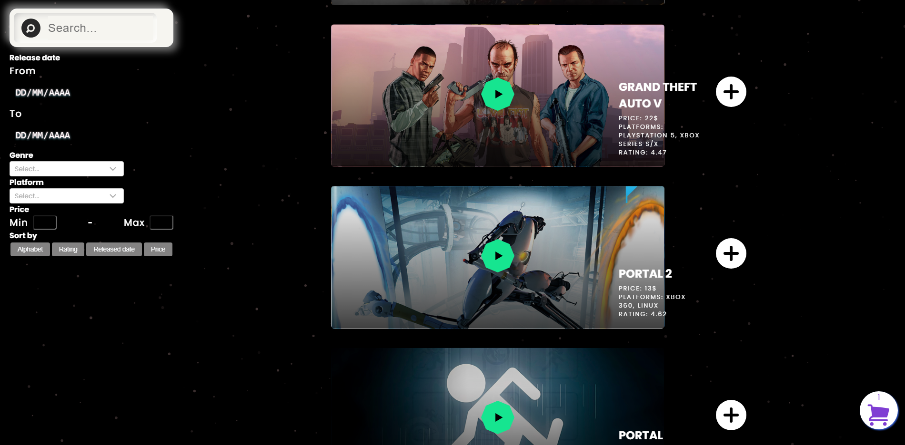

# 🎮 Ztreamgames

Ztreamgames is a full-stack web application that simulates a modern video game digital store. Users can register, log in (either locally or via Google), explore a curated catalog of games, add them to their cart, rate and comment, connect with friends, and make purchases through MercadoPago.

> 🚧 This project was developed as a group project during the **Soy Henry bootcamp** for educational purposes only. All data and functionalities are simulated.

---

## ✨ Features

- 🔐 Local and Google authentication system
- 🔍 Game catalog with search, filtering, and sorting
- 💳 Game purchase system using **MercadoPago**
- 👥 Friends system
- ⭐ Rating and comment system per game
- 🛠️ Admin panel for user banning and moderation

---

## 📸 Screenshots

### 🏠 Home Page


### 🔍 Game Catalog


### 🔍 Game Detail


### 🛒 Cart


---

## ⚙️ Technologies Used

- **Frontend:** React, Redux Toolkit, CSS, SCSS
- **Backend:** Node.js, Express, MongoDB
- **Auth:** JWT, Google OAuth
- **Payments:** MercadoPago SDK
- **Other:** Mongoose, dotenv, bcrypt, etc.

---

## 🧪 Testing Payments with MercadoPago
To simulate purchases in the app, you must use a MercadoPago test user. You can create one from the MercadoPago Developer Panel.

Log in using a buyer test account.

Add products to your cart and complete the payment process as usual.

No real transactions will be made — this is a secure testing environment.

You can create one from the [MercadoPago Developer Panel](https://www.mercadopago.com.ar/developers/panel/test-users).

📌 Important: If you use a real MercadoPago account without testing permissions, payments will not work properly.

---

## 🚀 Getting Started

### 1. Clone the repository

```bash
git clone https://github.com/Shaikohn/Ztreamgames.git
cd Ztreamgames

```
### 2. Install dependencies

```bash
# client
cd client
npm i

# api
cd api
npm i

```

### 3. Setup your .env file

Create a .env file in the api/ directory and add the following variables:

```bash

MONGO_URI=your_mongodb_uri
PORT=your_port_number
API_KEY=your_api_key
JWT_secret_key=your_jwt_secret_key
GOOGLE_CLIENT_ID=your_google_client_id
GOOGLE_SECRET_ID=your_google_secret_id
COURRIER_API_KEY=your_courrier_api_key

```

### 📦 4. Run Locally

```bash
# client
cd client
npm start

# api
cd api
npm start

```

## 🙌 Credits
This project was created by a team of developers as part of the final group project for the Soy Henry full-stack web development bootcamp.

All functionalities are part of a simulated experience for educational purposes only. No real transactions or user data are involved.